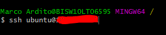
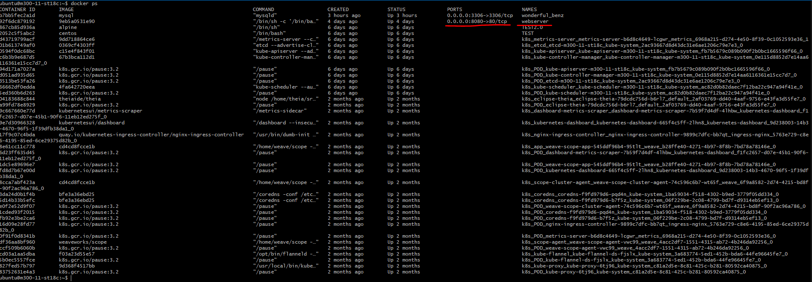
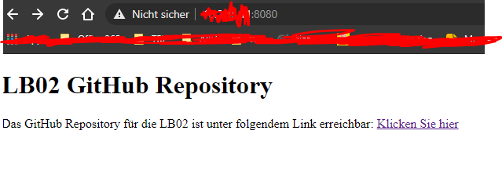
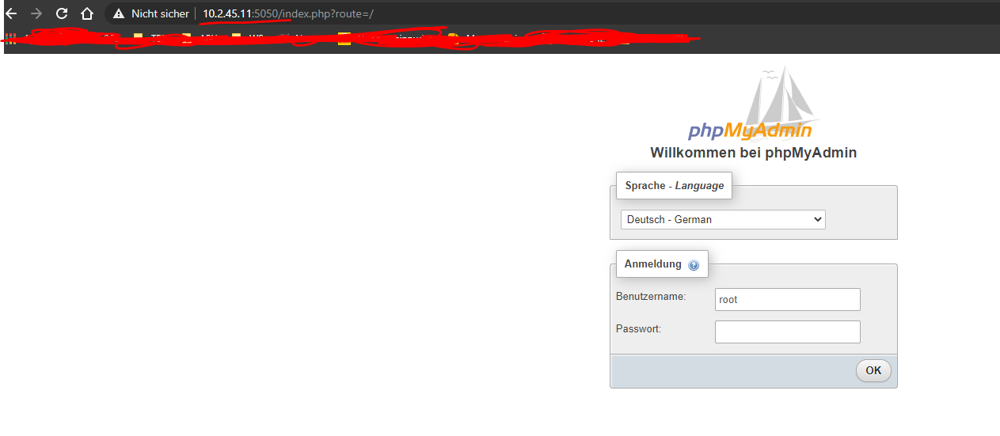
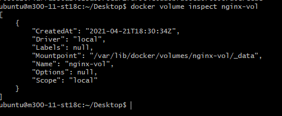
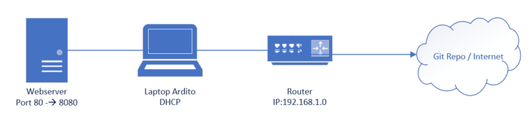
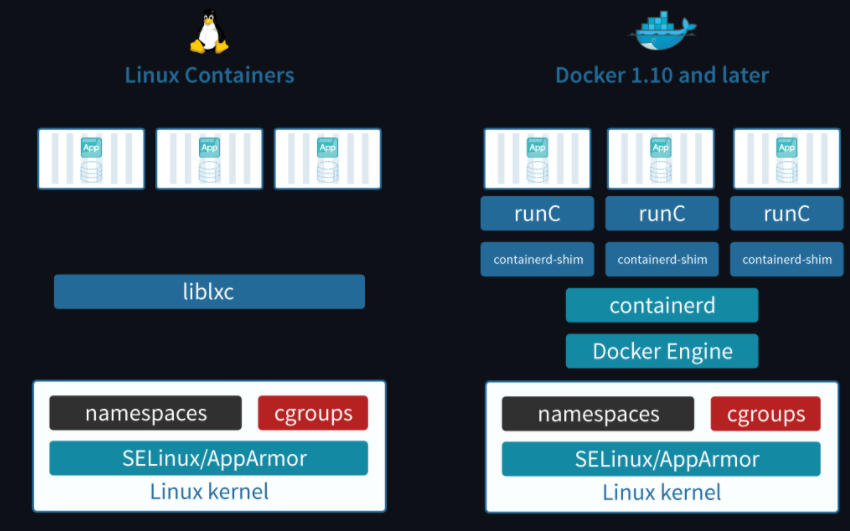
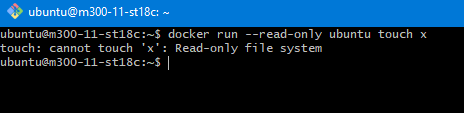

# Docker
Was ist Docker?

Docker ist eine Freie Software zur Isolierung von Anwendungen mit Hilfe von Containervirtualisierung. Docker vereinfacht somit die Bereitstellung von Anwendungen, weil sich Container leicht als Dateien transportieren und installlieren lassen.
## Bestehende Docker-Container kombinieren

Hier wurden zwei verschiedene Container zusammen kombiniert und zwar den Apache Webserver mit dem Mysql Datenbankserver

## Apache Webserver

Zuerst Im GitBASH via SSH auf den Server verbinden

```
ssh ubuntu@IPADRESSE
```


Wenn man dann Angemeldet ist, kann man einen Speicherort für das Dockerfile des Webservers aussuchen. Ich habe es auf dem Desktop Ordner gespeichert.

Apache Dockerfile:

```
#	Apache Umgebung 
FROM ubuntu:14.04
MAINTAINER Marco Ardito

RUN apt-get update

RUN apt-get -q -y install apache2 

# Konfiguration Apache
ENV APACHE_RUN_USER www-data
ENV APACHE_RUN_GROUP www-data
ENV APACHE_LOG_DIR /var/log/apache2

RUN mkdir -p /var/lock/apache2 /var/run/apache2


#phpMyadmin promt-Config
RUN echo 'phpmyadmin phpmyadmin/dbconfig-install boolean true' | debconf-set-selections
RUN echo 'phpmyadmin phpmyadmin/app-password-confirm password marco1234' | debconf-set-selections
RUN echo 'phpmyadmin phpmyadmin/mysql/admin-pass password marco1234' | debconf-set-selections
RUN echo 'phpmyadmin phpmyadmin/mysql/app-pass password marco1234' | debconf-set-selections
RUN echo 'phpmyadmin phpmyadmin/reconfigure-webserver multiselect apache2' | debconf-set-selections


#phpMyadmin Installation
RUN sudo apt-get -y install phpMyadmin

EXPOSE 80

VOLUME /var/www/html

CMD /bin/bash -c "source /etc/apache2/envvars && exec /usr/sbin/apache2 -DFOREGROUND"
```
Dann kann man das Dockerfile anhand dieses Befehls ausführen.

```
docker build -t apache .
```
und anschliessend noch den Port weiterleiten, da er schon besetzt ist.
```
docker run --rm -d -p 8080:80 webserver
```
Wenn man das so gemacht hat, dann sieht es so aus im ```docker ps ```.



Jetzt noch die index.html Datei verwenden, damit man sich gleich im Github weiterleiten kann.

Deswegen kann man eine html Datei Kopieren mit diesem docker Befehl.

```
docker cp /SpeicherortDerDatei/index.html ContainereName:/var/www/html/
```
Dann sollte es so aussehen:



## Bestehende Container als Backend, Desktop-App als Frontend einsetzen

Ein Backend Container könnte einen Mysql Datenbank Server sein und der Frontend unseren Apache Webserver.

Ich habe es jedoch mit dem Webserver gemacht.

## Mysql

Befehle Mysql:

```
$ docker pull mysql:8.0.1

$ docker run --name NameDesMysqlServer -e MYSQL_ROOT_PASSWORD=PASWWORTEINGEBEN -d mysql:8.0.1

$ docker pull phpmyadmin/phpmyadmin:latest

$ docker run --name PHPNAMEEINGEBEN -d --link MYSQLNAMEEINGEBEN:db -p 5050:80 phpmyadmin/phpmyadmin

```

Dann müsste es so aussehen:



Das Dockerfile könnte auch so ausschauen:

```
# Image herunterladen
RUN docker pull mysql:8.0.1

# Mysql name setzen + passwort setzen
RUN docker run --name mysql -e MYSQL_ROOT_PASSWORD=password -d mysql:8.0.1

# Image herunterladen phpmyadmin
RUN docker pull phpmydmin/phpmyadmin:latest

# port weiterleitung von 80 auf 5050
RUN docker run --name phpmyadmin -d --link mysql:db -p 5050:80 phpmyadmin/phpmyadmin

```

## Volumes zur persistenen Datenablagen eingerichtet

Um ein Volume zu erstellen, muss man die Folgende befehele eingeben:

```
$ docker run -d --name=nginxtest --mount source=nginx-vol,destination=/usr/share/nginx/html,readonly nginx:latest
```

Volume anzeigen mit folgendem Befehl: (Testfall)

```
$ docker volume inspect nginx-vol
```




## Kennt die Docker spezifischen Befehle

| Befehl                       | Effekt                         |
| ---------------------------- |:------------------------------:|
| docker stats | Zeigt ressourcennutzung der Container in Echtzeit |
| docker info | Zeigt Informationen zum System |
| docker login | Im Docker Hub anmelden |

                                        
| Befehl                       | Effekt                         |
| ---------------------------- |:------------------------------:|
| docker pull *imagename* | Lädt das Image vom Docker Hub herunter  |
| docker run --name *imageID* | Startet ein bestimmtes Image |
| docker run -it *imageID* | Startet ein bestimmtes Image und zeigt die Befehlszeile an |
| docker build -t *imagename* | Erstellt ein Image vom Dockerfile mit dem festgelegten Namen im Verzeichnis |
| docker images | Zeigt eine Übersicht der Images an |
| docker image rm *imagename* | Löscht das Image |
| docker image rmi *imagename* | Löscht das Image |
| docker rmi `docker images -q -f dangling=true` | Zwischenimages löschen |

                                                
| Befehl                       | Effekt                         |
| ---------------------------- |:------------------------------:|
| docker start *ContainerID* | Startet den Container |
| docker container ls | Zeigt alle laufenden Container an. |
| docker container start -i *containername* | Startet einen gestoppten Container |
| docker container stop *containername* | Stoppt den laufenden Container. |
| docker kill | Stop den Hauptprozess des Containers |
| docker network ls | Zeit alle Netzwerke an. |
| docker rm -f $(docker ps -aq) | Löscht alle laufenden und gestoppten Container |
| docker logs --tail 100 *containername* | Zeigt die 100 letzten Zeilen des Container logs an. |
| docker ps  | Zeigt alle aktiven Container an |
| docker ps -a | Zeigt alle Container an |
| docker run --rm -d -p 3306:3306 mysql | Mysql an port 3306 binden für Internetzugriff |
| docker inspect *containername* | Zeigt Infos zum Container an |

## Eingerichtete Umgebung ist dokumentiert (Umgebungs-Variablen, Netzwerkplan gezeichnet, Schichtenmodell, Sicherheitsaspekte)

### Umgebungsvariabeln

Es gibt mehrere Teile von Compose, die sich auf die eine oder andere Weise mit Umgebungsvariablen beschäftigen.

Ersetzen von Umgebungsvariablen in Compose-Dateien:

Es ist möglich, Umgebungsvariablen in Ihrer Shell zu verwenden, um Werte innerhalb einer Compose-Datei zu ersetzen:

Wenn Sie mehrere Umgebungsvariablen haben, können Sie diese ersetzen, indem Sie sie zu einer Standard-Umgebungsvariablendatei namens ".env" hinzufügen oder indem Sie einen Pfad zu Ihrer Umgebungsvariablendatei mit der Befehlszeilenoption --env-file angeben.

Die ".env"-Datei
Sie können Standardwerte für alle Umgebungsvariablen, auf die in der Compose-Datei verwiesen wird oder die zur Konfiguration von Compose verwendet werden, in einer Umgebungsdatei namens .env festlegen. Der Pfad der .env-Datei lautet wie folgt:

Ab +v1.28 wird die .env.-Datei an der Basis des Projektverzeichnisses platziert
Bei früheren Versionen wird sie im aktuellen Arbeitsverzeichnis platziert, in dem der Docker Compose-Befehl ausgeführt wird, es sei denn, es ist ein --project-directory definiert, das den Pfad für die .env-Datei außer Kraft setzt. Diese Inkonsistenz wird in +v1.28 behoben, indem der Dateipfad auf das Projektverzeichnis beschränkt wird.
$ cat .env
TAG=v1.5

$ cat docker-compose.yml
version: '3'
Dienste:
  web:
    image: "webapp:${TAG}"
Wenn Sie docker-compose up ausführen, verwendet der oben definierte Webdienst das Image webapp:v1.5. Sie können dies mit dem Befehl config überprüfen, der Ihre aufgelöste Anwendungskonfiguration in das Terminal ausgibt:

$ docker-compose config

version: '3'
services:
  web:
    'image': 'webapp:v1.5'
Werte in der Shell haben Vorrang vor denen, die in der .env-Datei angegeben sind.

Wenn Sie TAG in Ihrer Shell auf einen anderen Wert setzen, verwendet die Ersetzung in image stattdessen diesen Wert:

$ export TAG=v2.0
$ docker-compose-Konfiguration

version: '3'
Dienste:
  web:
    'image: 'webapp:v2.0'
Sie können den Pfad der Umgebungsdatei mit dem Kommandozeilenargument --env-file überschreiben.

Verwendung der Option "--env-file"
Indem Sie die Datei als Argument übergeben, können Sie sie an beliebiger Stelle speichern und entsprechend benennen, z. B. .env.ci, .env.dev, .env.prod. Die Übergabe des Dateipfads erfolgt mit der Option --env-file:

docker-compose --env-file ./config/.env.dev up 
Dieser Dateipfad ist relativ zum aktuellen Arbeitsverzeichnis, in dem der Docker-Compose-Befehl ausgeführt wird.

$ cat .env
TAG=v1.5

$ cat ./config/.env.dev
TAG=v1.6


$ cat docker-compose.yml
version: '3'
Dienste:
  web:
    image: "webapp:${TAG}"
Die .env-Datei wird standardmäßig geladen:

$ docker-compose config 
version: '3'
Dienste:
  web:
    Image: 'webapp:v1.5'
Durch die Übergabe des Arguments --env-file wird der Standard-Dateipfad überschrieben:

$ docker-compose --env-file ./config/.env.dev config 
version: '3'
Dienste:
  web:
    image: 'webapp:v1.6'
Wenn ein ungültiger Dateipfad als --env-file Argument übergeben wird, gibt Compose einen Fehler zurück:

$ docker-compose --env-file ./doesnotexist/.env.dev config
ERROR: Couldn't find env file: /home/user/./doesnotexist/.env.dev
Weitere Informationen finden Sie im Abschnitt Variablensubstitution in der Compose-Dateireferenz.

Setzen von Umgebungsvariablen in Containern
Sie können Umgebungsvariablen in den Containern eines Dienstes mit dem Schlüssel 'environment' setzen, genau wie mit docker run -e VARIABLE=VALUE ...:

web:
  environment:
    - DEBUG=1
Übergeben von Umgebungsvariablen an Container
Sie können Umgebungsvariablen von Ihrer Shell direkt an die Container eines Dienstes mit dem Schlüssel 'environment' übergeben, indem Sie ihnen keinen Wert geben, genau wie bei docker run -e VARIABLE ...:

web:
  environment:
    - DEBUG
Der Wert der DEBUG-Variable im Container wird aus dem Wert für dieselbe Variable in der Shell übernommen, in der Compose ausgeführt wird.

Die Konfigurationsoption "env_file"
Mit der Option "env_file" können Sie mehrere Umgebungsvariablen aus einer externen Datei an die Container eines Dienstes übergeben, genau wie mit docker run --env-file=FILE ...:

web:
  env_file:
    - web-variables.env
Setzen von Umgebungsvariablen mit 'docker-compose run'
Ähnlich wie bei docker run -e können Sie mit docker-compose run -e Umgebungsvariablen auf einem einzelnen Container setzen:

docker-compose run -e DEBUG=1 web python console.py
Sie können eine Variable auch von der Shell übergeben, indem Sie ihr keinen Wert geben:

docker-compose run -e DEBUG web python console.py
Der Wert der DEBUG-Variable im Container wird von dem Wert für dieselbe Variable in der Shell übernommen, in der Compose ausgeführt wird.

Wenn Sie dieselbe Umgebungsvariable in mehreren Dateien setzen, ist hier die Priorität, die von Compose verwendet wird, um den zu verwendenden Wert auszuwählen:

Compose-Datei
Shell-Umgebungsvariablen
Umgebungsdatei
Dockerdatei
Variable ist nicht definiert
Im folgenden Beispiel setzen wir die gleiche Umgebungsvariable in einer Umgebungsdatei und in der Compose-Datei:

$ cat ./Docker/api/api.env
NODE_ENV=test

$ cat docker-compose.yml
version: '3'
Dienste:
  api:
    image: 'node:6-alpine'
    env_file:
     - ./Docker/api/api.env
    Umgebung:
     - NODE_ENV=production


### Netzwerkplan



### Schichtenmodell




### Sicherheitsaspekte

An was für Sicherheitsprobleme soll man denken?

Kernel Exploits:

Sollte ein Container eine Kernel Panic verursachen, zieht das den ganzen Host mit herunter. In VMs ist die Situation viel besser – ein Angreifer müsste einen Angriff sowohl durch den VM-Kernel als auch den Hypervisor leiten, bevor er an den Host-Kernel kommt.

Denial-of-Service-(DoS-)Angriffe:

Kann ein Container den Zugriff auf bestimmte Ressourcen ganz für sich beanspruchen – auch so etwas wie den Speicher oder esoterischere Ressourcen wie User IDs (UIDs) –, kann er die anderen Container auf dem Host verhungern lassen.

Container-Breakouts:

Ein Angreifer, der Zugriff auf einen Container erhält, sollte nicht dazu in der Lage sein, auf andere Container oder den Host zuzugreifen. Da die Benutzer nicht über Namensräume getrennt sind, bekommen alle Prozesse, die aus dem Container ausbrechen, auf dem Host die gleichen Privilegien wie im Container – ist man im Container root, so wird man auch root auf dem Host sein.

Vergiftete Images:

Man sollte sich sicher sein, dass die Images nicht manipuliert wurden, sondern sicher sind.

Verratene Geheimnisse:

Greift ein Container auf eine Datenbank oder einen Service zu, muss er sehr wahrscheinlich ein Geheimnis wie einen API-Schlüssel oder Benutzernamen und Passwort kennen.

### Least Privilege

Jeder Prozess und Container sollte nur mit so viel Zugriffsrechten und Ressourcen laufen, wie er gerade braucht, um seine Aufgaben zu erfüllen.

Möglichkeiten:

* Prozesse in Containern nicht als root laufen
* Dateisysteme schreibgeschützt einsetzen
* Kernel-Aufrufe, die Container ausführen kann, einschränken
* Ressoucen begrenzen, um DoS-Angriffe zu verhindern

### Container absichern

Hier einige Absicherungsmethoden:

* Container laufen in VM
* Der Reverse-Proxy ist der einzige Container, der Port nach aussen freigibt
* Alle Images laufen nicht als root
* Images werden über eigenen Hash runtergeladen
* Anwendung wird überwacht und es wird Alarm ausgelöst
* Aktuelle Software

### Weitere Sicherheitstipps

* Netzwerkzugriff beschränken
* setuid/setgid-Binaries entfernen
* Speicher begrenzen

````
$ docker run -m 128m --memory-swap 128m amouat/stress stress --vm 1 --vm-bytes 127m -t 5s
````

* CPU beschränken
````
$ docker run -d --name load3 -c 512 amouat/stress
````
* Neustarts begrenzen
````
$ docker run -d --restart=on-failure:10 my-flaky-image
````
* Zugriffe aus Dateisysteme begrenzen
````
$ docker run --read-only ubuntu touch x
````


* Capabilities einschränken
````
$ docker run --cap-drop all --cap-add CHOWN ubuntu chown 100 /tmp
````
* Ressourcenbeschränkungen anwenden
````
$ docker run --ulimit cpu=12:14 amouat/stress stress --cpu 1
````


## Funktionsweise getestet inkl. Dokumentation der Testfälle

### Test Apache Server

Es wurde getestet und in dem vorherigen Punkt dokumentiert. Ich komme auf den Webserver mit meinem Lokalen Browser und kann mich auf meinem Repository weiterleiten mittels der Index.html Datei, die als Fronted und den Webserver als Backend funktioniert. (Mit Screenshots)


### Test Mysql Server

Ich konnte mich auf meinem Mysql via phpmyadmin verbinden und anmelden. Wurde ebenfalls in der vorherige Aufgabe dokumentiert. (Mit Screenshots)


### Test Volume

Ich konnte ein Volume einrichten und es auch ansehen. (Screenshot vom Testfall unter Aufgabe des Volumes)

## Projekt mit Git und Markdown dokumentiert

Wurde dokumentiert wie sie sehen. :)

