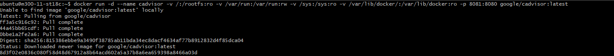
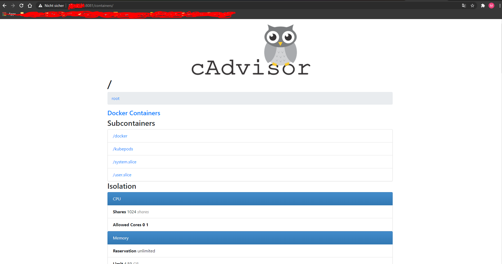
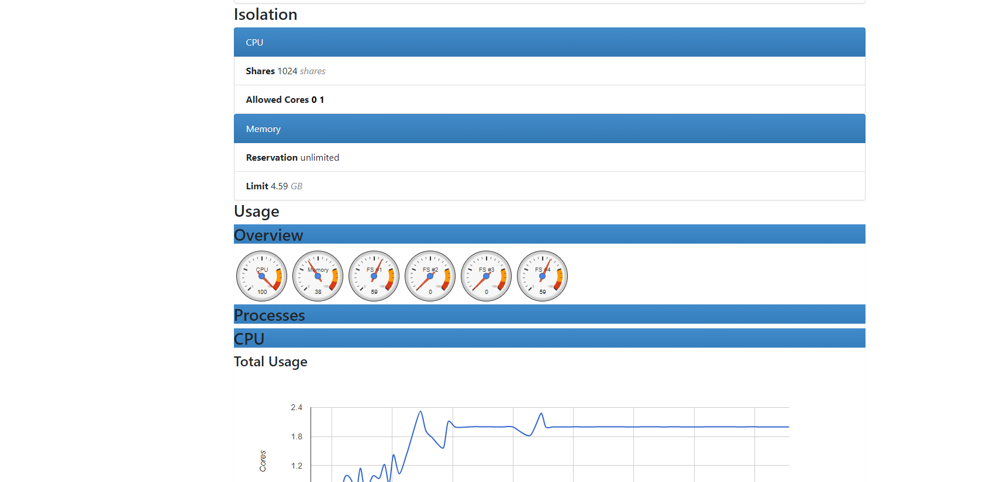

## Service-Überwachung ist eingerichtet

Ich habe als Monitoring Tool den Cadvisor eingerichtet, indem ich dieses Befehl eingegeben hatte.

```
$ docker run -d --name cadvisor -v /:/rootfs:ro -v /var/run:/var/run:rw -v /sys:/sys:ro -v /var/lib/docker/:/var/lib/docker:ro -p 8081:8080 google/cadvisor:latest
```

Dieser Befehl erstellt einen Container namens cadvisor mit den nötigen angaben und ich habe ihn direkt auf dem 8081 Port zugewiesen und es funktioniert.





Man kann den CPU Monitoren, man sieht den Memory stand, man kann sehen wie die auslastung im CPU ist usw.




## Aktive Benachrichtigung ist eingerichtet

Mit dem Dinu Image kann man laut Anleitung eine Meldung über, wenn man das Docker-Image überarbeitet hat.

```
$ docker pull crazymax/diun
```


## mind. 3 Aspekte der Container-Absicherung sind berücksichtigit

Die Aspekte von der Container-Absicherung wurden schon im Kapitel [10-Docker](10-Docker.md) gezeigt und beschrieben.


## Sicherheitsmassnahmen sind dokumentiert (Bezug zur eingerichtetten Umgebung ist vorhanden)

Sicherhetismassnahmen wurden Dokumentiert. :)


## Projekt mit Git und Markdown dokumentiert

Projekt wurde Dokumentiert wie sie sehen können.  :)

