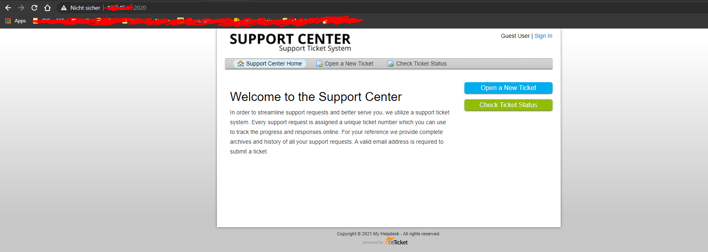

## Umsetzung eigener Ideen

Ich hätte eine Idee gehabt, und zwar ein eigens Ticketsystem aufzusetzen via Docker. Ich habe dafür den osticket image heruntergeladen.

Man kann auch hier den Docker-Container kombinieren anhand dieses Befehls:

```
$ docker run --name ostickket_mysql -d -e MYSQL_ROOT_PASSWORD=password -e MYSQL_USER=osticket -e MYSQL_PASSWORD=password -e MYSQL_DATABASE=osticket mariadb
```
Dann kann man noch den Port forwarden mit diesem Befehl:

```
$ docker run --name osticket -d --link osticket_mysql:mysql -p 2020:80 osticket/osticket
```
Wenn man diese zwei Schritte gemchat hat dann sollte man auf dem Webinterface zugreiffen können.

Mit der IPADRESSE:2020




## Umsetzung eigener Iddeen: Übungsdokumentation als Vorlage für Modul-Unterlagen erstellt


## Persönliche Lernentwicklung: Vergleich Vorwissen - Wissenszuwachs

Am Anfang der LB02 hatte ich noch nie etwas mit Docker und Kubernetes zu tun gehabt. Für so eine kurze Zeit konnte ich mein Wissen sehr entwickeln in diesem Bereich. Ich konnte die meisten, wenn nicht sogar alle Ziele erreichen des Kompetenzrasters und hatte sogar ein Ticketsystem mit Docker aufgesetzt und in Betrieb genommen für mein Projekt.

Die LB02 fand ich spannender als die LB mit den Vagrant file, obwohl es sehr ähnlich ist. Ich konnte anhand von den Anleitungen und den Theorie stunden sehr vieles mitenehmen für die Zukunf und hoffe, dass ich es auch in meinem Lehrbetrieb anwenden werden kann.

## Persönliche Lernentwicklung: Reflexion

Also wenn ich vor zehn Wochen zurück schaue, dann konnte ich mir nicht vorstellen, dass ich jemals nach so einer kurzen Zeit mich so gut auseinander setzen konnte mit Docker, Kubernetes, GitHub, GitCMD, GitBash, Vagrant usw. Ich fand dieses Modul am Anfang sehr kompliziert, jedoch als ich mich auseinander setzte mit den Themen verstand ich das Thema sehr schnell und es machte vorallem sehr Spass mit diesen Umgebungen zu arbeiten.

Das nächste mal wäre es besser gewesen, dass man mehr Zeit für ein einziges Projekt hat, damit man auch die eigene Kreativität in Beanspruch nehmen kann.