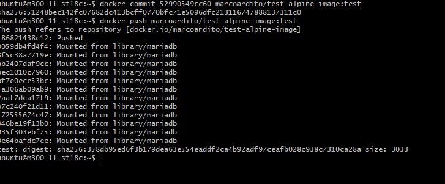
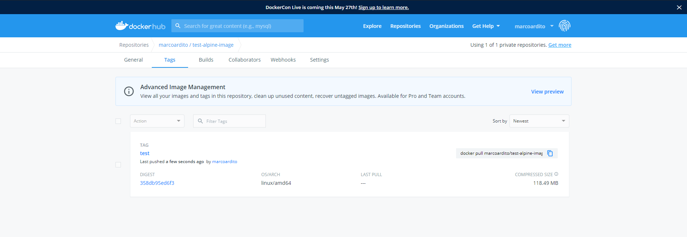

## Umfangreiche Vernetzung der Container-Infrastruktur (Ansätze für reale Nutungsszenarien)


## Image-Bereitstellung

Man muss zuerst ein Container auswählen, welches man pushen möchte.
Man braucht dazu die ContainerID

```
$ docker commit(Container ID) (DockerHub Username)/(Gewünschter Name):(Tag)
```
Danach muss man das mit dem folgendem Befehl pushen:
```
$ docker push (DockerHub Username)/(Gewünschter Name):(Tag)
```
Dann sollte es so aussehen auf der Konsole:



und auf DockerHub sollte es so aussehen:



## Continous Integration

Mein Build wurde erfolgreich erstellt.
Die File die ich erstellt hatte waren drei. Ein .travis.yml File, ein hello.js File und ein package.json File.

.travis.yml
```
language: node_js
node_js:
 - "node"

```
hello.js
```
var http = require('http');
http.createServer(function (req, res) {
  res.writeHead(200, {'Content-Type': 'text/plain'});
  res.end('Hello Travis!\n'); // build should pass now!
}).listen(1337, '127.0.0.1');
console.log('Server running at http://127.0.0.1:1337/');

```
package.json

```
{
  "name": "learn-travis-Marco",
  "description": "Simple Travis-CI check for JSHint (Code Linting)",
  "author": "your name here :-)",
  "version": "0.0.1",
  "devDependencies": {
    "jshint": "^2.6.0"
  },
  "scripts": {
    "test": "jshint hello.js"
  }
}

```


## Cloud-Integration


## Elemente aus Kubernetesübung sind dokumentiert


