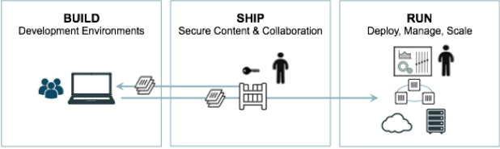

## Umfangreiche Vernetzung der Container-Infrastruktur (Ansätze für reale Nutungsszenarien)


## Image-Bereitstellung

Man muss zuerst ein Container auswählen, welches man pushen möchte.
Man braucht dazu die ContainerID

```
$ docker commit(Container ID) (DockerHub Username)/(Gewünschter Name):(Tag)
```
Danach muss man das mit dem folgendem Befehl pushen:
```
$ docker push (DockerHub Username)/(Gewünschter Name):(Tag)
```
Dann sollte es so aussehen auf der Konsole:


und auf DockerHub sollte es so aussehen:


## Continous Integration

Mein Build wurde erfolgreich erstellt.
Die File die ich erstellt hatte waren drei. Ein .travis.yml File, ein hello.js File und ein package.json File.

.travis.yml
```
language: node_js
node_js:
 - "node"

```
hello.js
```
var http = require('http');
http.createServer(function (req, res) {
  res.writeHead(200, {'Content-Type': 'text/plain'});
  res.end('Hello Travis!\n'); // build should pass now!
}).listen(1337, '127.0.0.1');
console.log('Server running at http://127.0.0.1:1337/');

```
package.json

```
{
  "name": "learn-travis-Marco",
  "description": "Simple Travis-CI check for JSHint (Code Linting)",
  "author": "your name here :-)",
  "version": "0.0.1",
  "devDependencies": {
    "jshint": "^2.6.0"
  },
  "scripts": {
    "test": "jshint hello.js"
  }
}

```

## Cloud-Integration



Man kann sogenannte nods erstellen und diese mit dem Docker Cloud Account verknüpfen. Ähnlich wie bei dem Image-Integration.

Das system dahinter ist das gleiche, einfach dass man anstatt Images abrufen kann Nodes abruft mit Containers auf Docker Cloud.

## Elemente aus Kubernetesübung sind dokumentiert

### Kubernetes deployment erstellen

Ich konnte es leider nicht mehr ausführen, da ich keinen Zugriff auf dem Server hatte. Jedoch sind das die Befehle und Yaml Files, die ich verwendet hatte um alles einzurichten.

Zuerst im Ordner drei verschiedene Files erstellen.

* deployment.yml
```
---
apiVersion: apps/v1
kind: Deployment
metadata:
  name: phpmyadmin-deployment
  labels:
    app: phpmyadmin
spec:
  replicas: 1
  selector:
    matchLabels:
      app: phpmyadmin
  template:
    metadata:
      labels:
        app: phpmyadmin
    spec:
      containers:
        - name: phpmyadmin
          image: phpmyadmin/phpmyadmin
          ports:
            - containerPort: 80
          env:
            - name: PMA_HOST
              value: mysql-service
            - name: PMA_PORT
              value: "3306"
            - name: MYSQL_ROOT_PASSWORD
              valueFrom:
                secretKeyRef:
                  name: mysql-secrets
                  key: root-password

```

```
kubectl apply -f deployment.yml
```

* service.yml
```
---
apiVersion: v1
kind: Service
metadata:
  name: phpmyadmin-service
spec:
  type: NodePort
  selector:
    app: phpmyadmin
  ports:
  - protocol: TCP
    port: 80
    targetPort: 80
```

```
kubectl apply -f service.yml
```
* ingress.yml
```
---
apiVersion: extensions/v1beta1
kind: Ingress
metadata:
  name: phpmyadmin-http-ingress
spec:
  backend:
    serviceName: phpmyadmin-service
    servicePort: 80
```

```
kubectl apply -f ingress.yml
```

Zertifikate + Key müssen gestored werden:

```
kubectl create secret generic ingress-tls-secret --from-file=tls.crt=server.crt --from-file=tls.key=server.key --from-file=ca.crt=ca.crt
```

Die Test ergebnisse konnte ich leider nicht Dokumentieren, da ich keinen Zugriff auf den Servre hatte.


