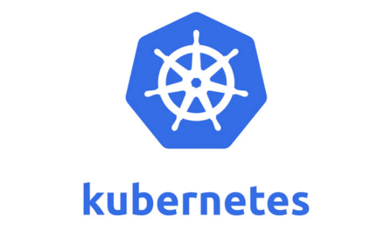
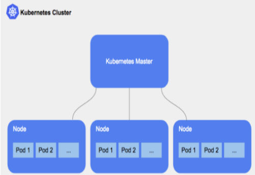

# Kubernetes



## Was ist Kubernetes

Kubernetes ist ein Open-Source System zur Automatiesierung der Bereitstellung, Skalierung und Verwaltung von Container-Anwendungen.

## Kubernetes Cluster



Bei einem Cluster wird ein Kubernetes Master und mehrer Worker erzeugt. Diese Umgebung eignet sich zur Demonstration einer Verteilten Umgebung.

Konfiguration

```
master: count 1 cpus: 2 memory: 5120 worker: count: 2
```

Es wird ein Mster und zwei Worker Nodes erstellt. Der Master und die Worker Nodes werden während der installation automatisch miteinander gejoint.

```
use_dhcp: false Fixe IP Adressen mit welchen die IP fuer Master und Worker beginnen sollen ip: master: 192.168.137.100 worker: 192.168.137.111 Netzwerk "private_network" fuer Host-only Netzwerk, "public_network" fuer Bridged Netzwerke net: network_type: private_network
```

Die restlichen Standardeinstellungen wie Host-only Netzwerk mit fixen Ip-Adressen kann 1:1 verwendet werden.

## Kubernetes Befehle
Apply a configurationto a resource

```
$ kubectl apply
```

Execute a command in a container

```
kubectl exec
```

Modify kubeconfig files using subcommands

```
kubectl config
```

Create an drun a particualr image in a pod

```
kubectl run
```

Copy files and directories to and from containers.

```
kubectl cp
```

