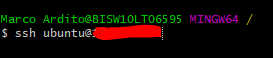

# Docker
Was ist Docker?

Docker ist eine Freie Software zur Isolierung von Anwendungen mit Hilfe von Containervirtualisierung. Docker vereinfacht somit die Bereitstellung von Anwendungen, weil sich Container leicht als Dateien transportieren und installlieren lassen.
## Bestehende Docker-Container kombinieren

Hier wurden zwei verschiedene Container zusammen kombiniert und zwar den Apache Webserver mit dem Mysql Datenbankserver

## Apache Webserver

Zuerst Im GitBASH via SSH auf den Server verbinden

```
ssh ubuntu@IPADRESSE
```


Wenn man dann Angemeldet ist, kann man einen Speicherort für das Dockerfile des Webservers aussuchen. Ich habe es auf dem Desktop Ordner gespeichert.

Apache Dockerfile:

```
#	Apache Umgebung 
FROM ubuntu:14.04
MAINTAINER Marco Ardito

RUN apt-get update

RUN apt-get -q -y install apache2 

# Konfiguration Apache
ENV APACHE_RUN_USER www-data
ENV APACHE_RUN_GROUP www-data
ENV APACHE_LOG_DIR /var/log/apache2

RUN mkdir -p /var/lock/apache2 /var/run/apache2


#phpMyadmin promt-Config
RUN echo 'phpmyadmin phpmyadmin/dbconfig-install boolean true' | debconf-set-selections
RUN echo 'phpmyadmin phpmyadmin/app-password-confirm password marco1234' | debconf-set-selections
RUN echo 'phpmyadmin phpmyadmin/mysql/admin-pass password marco1234' | debconf-set-selections
RUN echo 'phpmyadmin phpmyadmin/mysql/app-pass password marco1234' | debconf-set-selections
RUN echo 'phpmyadmin phpmyadmin/reconfigure-webserver multiselect apache2' | debconf-set-selections


#phpMyadmin Installation
RUN sudo apt-get -y install phpMyadmin

EXPOSE 80

VOLUME /var/www/html

CMD /bin/bash -c "source /etc/apache2/envvars && exec /usr/sbin/apache2 -DFOREGROUND"
```
Dann kann man das Dockerfile anhand dieses Befehls ausführen.

```
docker build -t apache .
```
und anschliessend noch den Port weiterleiten, da er schon besetzt ist.
```
docker run --rm -d -p 8080:80 webserver
```
Wenn man das so gemacht hat, dann sieht es so aus im ```docker ps ```.


## Bestehende Container als Backend, Desktop-App als Frontend einsetzen

## Volumes zur persistenen Datenablagen eingerichtet

## Volumes zur persistenten Datenablage eingerichtet

## Kennt die Docker spezifischen Befehle

## Eingerichtete Umgebung ist dokumentiert (Umgebungs-Variablen, Netzwerkplan gezeichnet, S)

